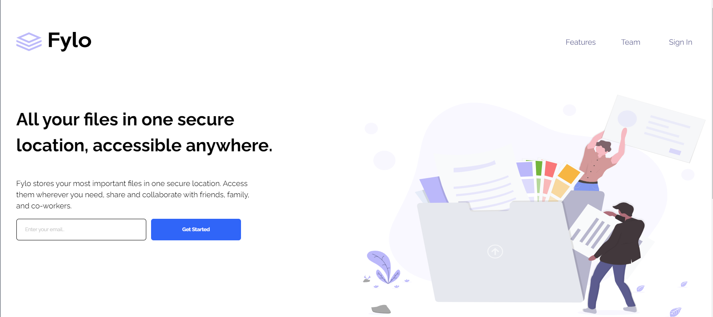
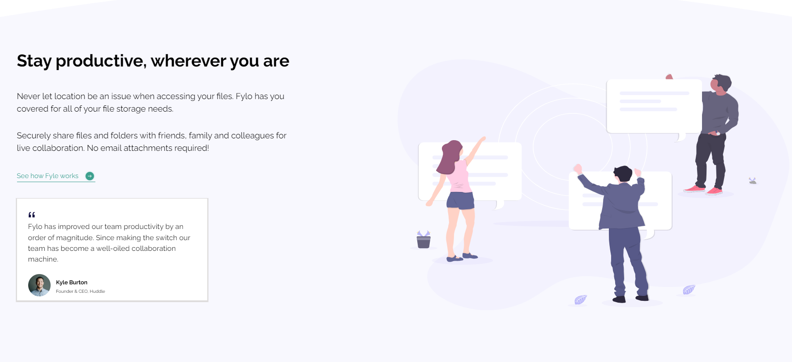
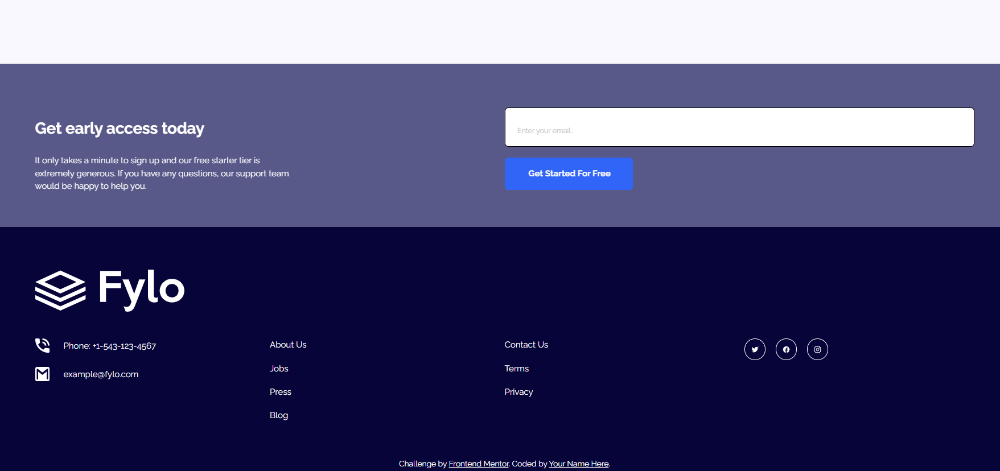

# Frontend Mentor - Fylo landing page with two column layout

## Welcome! 👋

Thanks for checking out this front-end coding challenge.

[Frontend Mentor](https://www.frontendmentor.io) challenges allow you to improve your skills in a real-life workflow.

**To do this challenge, you need a basic understanding of HTML and CSS.**

## The challenge

I realized the challengue, here I have the pictures about the landing page that it was resolved 

**Have fun building!** 🚀
